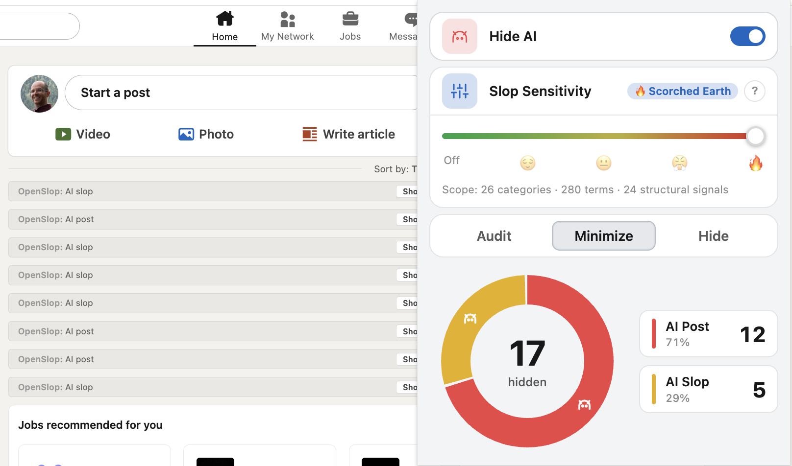

# OpenSlop

[](https://github.com/callmety/openslop/actions/workflows/ci.yml)
[](./LICENSE)
[](./PRIVACY.md)

> # 🚫 NOT FOR SALE.
>
> **This project is licensed under
> [PolyForm Noncommercial 1.0.0](./LICENSE) — a *source-available,
> noncommercial* license.**
>
> - ✅ Free for personal, hobby, study, research, nonprofit, education,
>   and government use.
> - ✅ You may fork, modify, and redistribute the source —
>   **provided your fork remains noncommercial too.**
> - ❌ **You may not sell this software, or any product or service
>   that incorporates it, in any form.** No paid extensions, no
>   paid SaaS, no paid downloads, no paid support tied to it, no
>   bundling it into a commercial product.
> - ❌ **You may not relicense it under a permissive license that
>   would allow commercial use.** The noncommercial restriction
>   carries forward to every fork.
> - 🚫 **There is no commercial license available.** Do not contact
>   the original author asking to buy one — none will be granted.
>
> See [License](#license) below and the full
> [LICENSE](./LICENSE) file for the exact terms.

A browser extension that hides AI-generated slop from your feed with a
single sensitivity slider. No accounts, no servers, no telemetry.

The first adapter ships against one large professional-networking site
where AI slop has become especially loud. The engine — preset catalog,
slop scorer, observer, popup, settings, session stats — is intentionally
site-agnostic, so adapters for other places where AI slop has taken over
(X, Reddit, Threads, Facebook, YouTube comments, anywhere a feed exists)
can be dropped in without touching the rest.

> 🪦 **This project is unmaintained.** The original author has moved on
> and is not accepting bug reports, feature requests, security reports,
> PRs, or other contact about this project. The repo is left up as
> source for **noncommercial use only** under the
> [PolyForm Noncommercial 1.0.0](./LICENSE) license — see
> [License](#license) below. The recommended path is to **fork** and
> run it yourself.

> ⚠️ **Unofficial / unaffiliated.** OpenSlop is an independent project.
> It is **not affiliated with, endorsed by, or sponsored by** any site
> it runs on, or any parent or sister company. Any trademarks
> referenced in code or docs are the property of their respective
> owners and are used only to factually describe where adapters
> operate.

## What it does



The popup is one screen — three small cards and a session donut:

1. **Hide AI Posts** — one-click toggle that hides posts whose text
   mentions "AI" and authors whose title includes "AI".
2. **Slop Sensitivity** — five-stop slider (Off → 🔥) that progressively
   suppresses AI-slop patterns: scam signals, lead-magnet funnels,
   engagement bait, hustle culture, AI hype, founder theater, motivational
   platitudes, and so on. Each stop is cumulative — see
   [`shared/presets.js`](./shared/presets.js) for the full catalog.
3. **Hidden-item mode** — segmented control choosing how matched posts are
   shown: **Audit** (keep visible with a reason strip), **Minimize**
   (collapse to a thin reason strip), or **Hide** (remove entirely).

Below those, the **session donut + live capsule** runs the whole session
you're browsing — categorized counts of what was hidden vs. shown,
refreshed live as the content script flags new posts.

That's it. Settings sync via `chrome.storage.sync` so a second browser
on the same Google/Microsoft account picks them up automatically.

## Install (developer mode)

There are no published GitHub releases and no Chrome Web Store / AMO
listing. Install from source:

**Chrome / Edge / Brave / other Chromium**
1. Open `chrome://extensions`.
2. Toggle **Developer mode** (top-right).
3. Click **Load unpacked** and select this folder.

**Firefox**
1. Open `about:debugging#/runtime/this-firefox`.
2. Click **Load Temporary Add-on** and select `manifest.firefox.json` inside
   this folder.

## Privacy

OpenSlop runs entirely in your browser. It stores settings in `chrome.storage`
and reads the page DOM. It makes **no network requests of any kind** — no
`fetch`, no analytics, no telemetry, no third-party servers.

See [PRIVACY.md](./PRIVACY.md) for the long version and
[docs/PERMISSIONS.md](./docs/PERMISSIONS.md) for the per-permission rationale.

## Architecture at a glance

```
popup/  ── settings via chrome.storage ──▶  content/  ── observes ──▶  site adapter
   ▲                                            │                       (currently one)
   └──────── session stats via chrome.storage ──┘
```

Three independent processes that only talk through `chrome.storage` —
no message-passing between the popup and the content script, no network.
The detection layers (presets, slop scorer, observer, popup) are
site-agnostic; per-site DOM knowledge lives in `shared/constants.js`
and a small set of content modules.
[`ARCHITECTURE.md`](./ARCHITECTURE.md) has the full file map.

### Project status

- **Manifest V3** (Chrome) and **Manifest V2** (Firefox) ship from a
  single source tree; both manifests are kept in lockstep by
  `npm run validate:extension`.
- **Two permissions** total: `storage` plus the host scope of the
  currently shipping adapter. No `tabs`, no `scripting`, no
  `webRequest`. See [`docs/PERMISSIONS.md`](./docs/PERMISSIONS.md).
- **Zero runtime dependencies.** All deps in `package.json` are
  `devDependencies` (Jest, ESLint, Playwright, jsdom). The shipped
  extension is plain `.js` + `.css` + `.html` — what you see in the
  source tree is what runs in the browser.
- **205 Jest unit tests across 16 files + a Playwright extension
  smoke spec** run on every PR via [CI](./.github/workflows/ci.yml). The smoke spec actually
  loads the extension into headless Chromium and asserts on real DOM
  behavior on fixture pages.
- **No store listing, no published releases.** `npm run build`
  produces `dist/openslop-chrome.zip` and `dist/openslop-firefox.zip`
  locally; install via developer mode (above).

## Develop (for forkers)

```bash
npm install
npm test                  # jest unit tests
npm run lint              # eslint, --max-warnings=0
npm run audit:branding    # legacy-name + denylist guard
npm run build             # dist/openslop-chrome.zip + dist/openslop-firefox.zip
npm run verify:release    # the full pre-PR check (everything above + e2e smoke)
```

[`CONTRIBUTING.md`](./CONTRIBUTING.md) has the dev loop, the file map
pointer, and how to add a new preset term — useful if you fork.

## Credits

The extension icon is the public-domain
["No AI art" symbol](https://commons.wikimedia.org/wiki/File:No_AI_art.svg)
from Wikimedia Commons. See [`icons/CREDITS.md`](./icons/CREDITS.md)
for details.

## License

**License: [PolyForm Noncommercial 1.0.0](./LICENSE).** A
*source-available, noncommercial* license.

### Permitted (any noncommercial purpose)

- Personal use, hobby projects, study, research, experimentation
- Use by nonprofits, schools, universities, public-research orgs,
  public-safety / health / environmental orgs, and government
  institutions
- Forking, modifying, and redistributing the source — **as long as
  your fork stays noncommercial under the same license.** The PolyForm
  Noncommercial license carries forward to all derivative works
  (see the [Changes and New Works License](./LICENSE#changes-and-new-works-license)
  and [Noncommercial Purposes](./LICENSE#noncommercial-purposes)
  sections of the license).

### Not permitted

- **Selling** the software, or any product or service that incorporates
  it, in any form. This includes:
  - Paid downloads, paid extensions on any web store
  - Paid SaaS or hosted services that include this code
  - Paid support, paid consulting, or paid maintenance tied to the
    software
  - Bundling it into a commercial product, even as a small component
  - Charging fees of any kind for access to a build of this software
- Any other commercial use, including internal use at a for-profit
  company that is not a "personal use" by an individual employee on
  their own time
- **Relicensing** it under any license that would permit commercial
  use. You can fork; you can't strip the noncommercial restriction
  off the fork.

### No commercial license available

There is **no commercial license** for this codebase. The original
author is not accepting commercial-licensing inquiries, will not grant
exceptions, and will not respond to requests. If you want an engine
like this for a commercial product, write your own.
